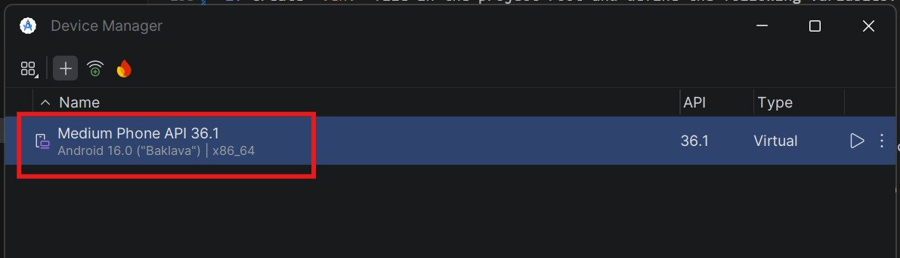
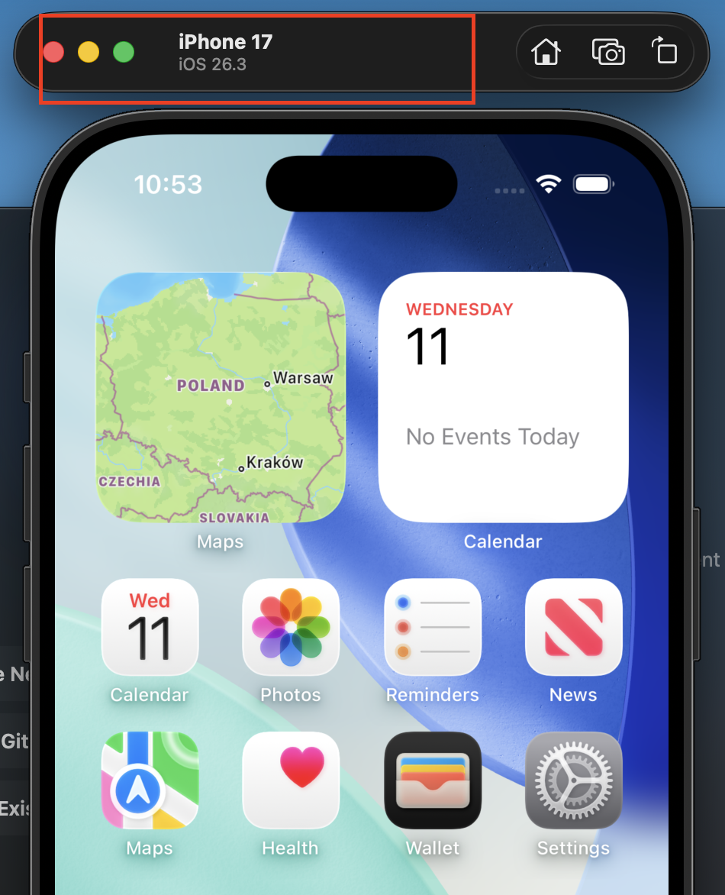

# Mobile testing demo (Appium + pytest)

## Table of Contents

- [1. Description](#1-description)
- [2. Prerequisites](#2-prerequisites)
- [3. Environment variables setup](#3-environment-variables-setup)
  - [Windows](#windows)
  - [macOS](#macos)
- [4. Appium installation](#4-appium-installation)
- [5. Android emulator setup](#5-android-emulator-setup)
- [6. iOS simulator setup (macOS users only)](#6-ios-simulator-setup-macos-users-only)
- [7. Project preparation](#7-project-preparation)
- [8. Running tests](#8-running-tests)

## 1. Description

This project demonstrates how **mobile automation testing** works using **Appium**, **Python**, and **Pytest**.

The purpose of this repository is to show how to structure a simple mobile automation framework and how simple user scenarios in a mobile application can be automated utilizing:

- **Appium** + **Pytest**
- **Page Object Model (POM)** pattern

## 2. Prerequisites

Before running the tests, make sure the following software is installed. If not, follow the links provided, download installation files of the latest stable version of the software, and follow the wizard instructions

- [NodeJS](https://nodejs.org/en/download) - required as the Appium server runs on NodeJS
- [Python](https://www.python.org/downloads/) - programming language used to write automation tests
- [Java](https://www.oracle.com/java/technologies/downloads/) - required for Android automation, since the UiAutomator2 driver depends on Java
- [Android Studio](https://developer.android.com/studio) - required to run Android emulator
- [Xcode (macOS only)](https://developer.apple.com/xcode/) - to run iOS automation tests, can be found in the Apple Store

## 3. Environment variables setup

Environment variables must be configured so Appium could locate **Java** and **Android SDK**.

### Windows

Go to `System → About → Advanced system settings → Environment Variables`. Create the following variables (you will have your own JDK version depending on which Java version you've installed, `<username>` - user under which you are logged in to the system):

- JAVA_HOME with `"C:\Program Files\Java\jdk-17"` value
- ANDROID_HOME with `"C:\Users\<username>\AppData\Local\Android\Sdk"` value

Add the following to **Path** variable:

```bash
%JAVA_HOME%\bin
%ANDROID_HOME%\platform-tools
```

### macOS

Open your Terminal and determine your shell:

```bash
echo $SHELL
```

- If it returns `/bin/zsh`, your configuration file is `~/.zshrc` (or `~/.zprofile`)
- If it returns `/bin/bash`, your configuration file is `~/.bash_profile`

Open your shell configuration, depending on the output of the previous command (below is the workflow for `/bin/zsh`):

```bash
nano ~/.zshrc
```

Add the following:

```bash
export JAVA_HOME=$(/usr/libexec/java_home)
export ANDROID_HOME=$HOME/Library/Android/sdk

export PATH=${PATH}:$JAVA_HOME/bin:$ANDROID_HOME/platform-tools:$ANDROID_HOME/tools
```

Apply the changes:

```bash
source ~/.zshrc
```

## 4. Appium installation

Install Appium globally via `npm`. Open your Terminal and execute the following:

```bash
npm install -g appium
```

Install Appium drivers:

```bash
appium driver install uiautomator2
```

...and:

```bash
appium driver install xcuitest
```

Verify installed drivers:

```bash
appium driver list
```

---

## 5. Android emulator setup

Open Android Studio and go to **SDK Manager** (`More Actions → SDK Manager`), ensure the following package is installed (listed under `SDK Tools` tab):

```bash
Android SDK Command-line Tools
```

Start an emulator in the menu `More Actions → Virtual Device Manager` or create a new one with desired configuration by clicking on `+` icon and start it.

## 6. iOS simulator setup (macOS users only)

Open Xcode and go to `Xcode → Settings → Components`. Make sure iOS simulators are installed. If not, add them by clicking on `Add Platforms...` button.

Open your Terminal and execute the following commands:

```bash
sudo xcode-select -s /Applications/Xcode.app/Contents/Developer
```

```bash
sudo xcodebuild -license accept
```

Launch the simulator:

```bash
Xcode → Open Developer Tool → Simulator
```

To change the simulator go to `File → Open Simulator` and choose the desired capabilities.

## 7. Project preparation

1. Open the code in any IDE and open the Terminal there.
2. Create `.env` file in the project root and define the following variables:

```bash
TEST_USERNAME="your_username"
TEST_PASSWORD="your_password"
```

Those could be any string in email format for `TEST_USERNAME` and any string of at least 8 characters for `TEST_PASSWORD`.
3. Open file `config/android_capabilities.py` and set the values according to the running Android device:

```python
"appium:deviceName"
"appium:platformVersion"
```

These values can be found here:



Open file `config/ios_capabilities.py` and do the same for running iOS device (if any). These values can be found here:


4. Install Python dependencies:

```bash
python3 -m pip install -r requirements.txt
```

## 8. Running tests

### Start Appium server

```bash
appium --log "logs/appium.log" --relaxed-security 
```

### Open another terminal and run tests

Example for Android:

```bash
pytest --platform=android
```

Example for iOS:

```bash
pytest --platform=ios
```

If `--platform` option is omitted, tests will be executed on Android platform by default.

Example output:

```bash
tests/test_app_login.py::test_should_be_able_to_login_successfully PASSED
tests/test_app_login.py::test_should_be_able_to_sign_up_successfully PASSED
```
